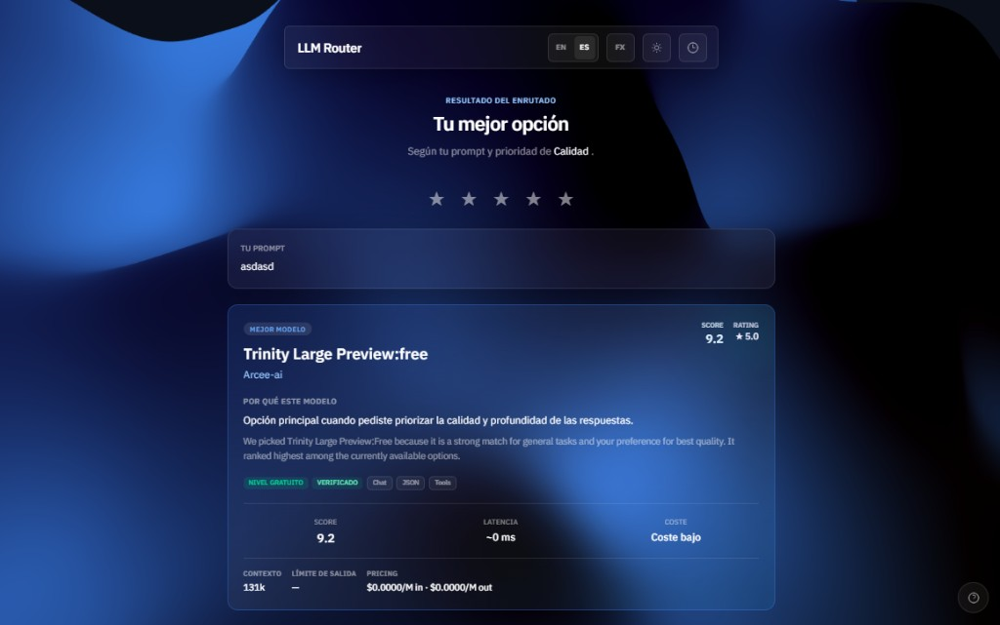
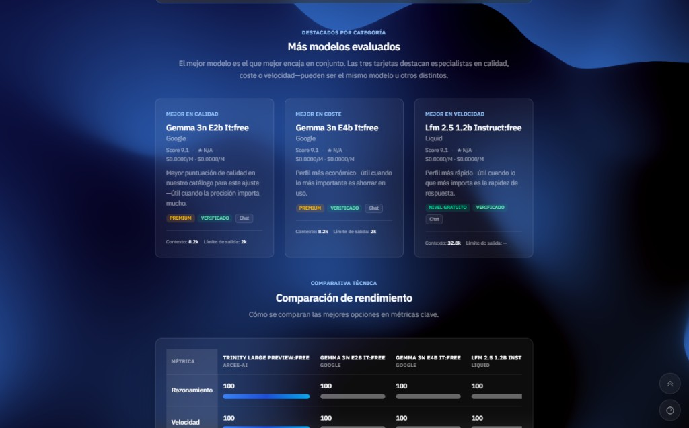
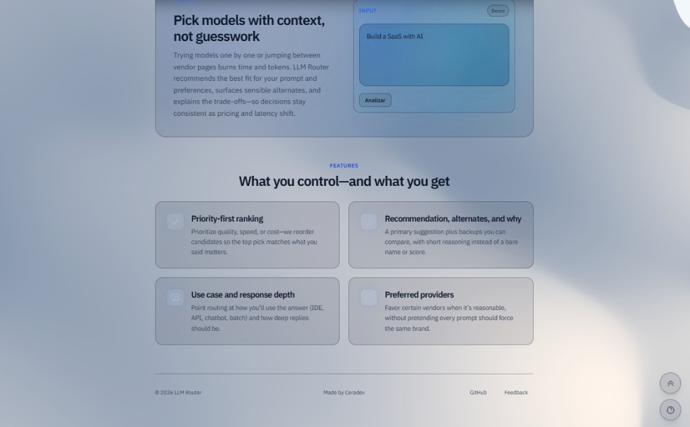

# LLM Router

LLM Router es una plataforma full-stack que analiza un prompt y recomienda (o ejecuta) el modelo LLM mas adecuado segun **calidad, coste, latencia y contexto de uso**.

No se limita a "devolver un modelo": explica la decision, conserva trazabilidad y aplica fallback si el proveedor falla.

## Que es y que objetivos tiene

El proyecto busca resolver la seleccion manual de modelos en entornos multi-provider.

Objetivos principales:

- elegir automaticamente el mejor candidato para cada request
- balancear calidad/coste/latencia segun la prioridad elegida
- explicar por que se eligio ese modelo
- persistir analisis, ranking, intentos y feedback
- mantener un catalogo vivo sincronizado con OpenRouter

## Como funciona (resumen)

1. Llega un prompt desde la UI o API.
2. Se clasifica su intencion y requisitos (codigo, tools, razonamiento, etc.).
3. Se cargan modelos elegibles del catalogo.
4. El motor de scoring calcula ranking por prioridad + contexto.
5. Se intenta ejecutar el top 1; si falla, aplica fallback.
6. Se devuelve respuesta + explicacion + ranking y metadatos.
7. Todo queda registrado en PostgreSQL para trazabilidad.

## Logica de evaluacion de modelos

La evaluacion es **heuristica y explicable** (no caja negra).  
Combina:

- componentes base: `quality_score`, `latency_score`, `cost_score`
- prioridad de negocio: `high_quality`, `low_cost`, `low_latency`, `balanced`
- bonus contextuales: capacidades (`code`, `tools`, JSON), `use_cases`, proveedor preferido
- bonus de confianza: modelos con estado `verified`
- ajuste por feedback: rating historico cuando hay muestra suficiente

Resultado: cada candidato obtiene un `final_score` con desglose y razon legible para la UI.

## Estructura del proyecto

```text
apps/
  server/   FastAPI + rutas + tests
  web/      Astro + React + UI de recomendacion

packages/
  core/             motor de scoring
  services/         evaluacion, seleccion, ejecucion, orquestacion, sync
  infrastructure/   DB, repositorios, proveedores, configuracion
  domain/           tipos de dominio
  schemas/          contratos de respuesta

migrations/         Alembic y dumps
docker-compose.yml  stack local (Postgres+backend+frontend)
.env.example        plantilla de variables (copiar a `.env`)
scripts/            scripts operativos (catalogo, monitor)
```

## Tecnologias usadas

- Frontend: Astro 6, React 19, TypeScript, Tailwind CSS, Framer Motion
- Backend: Python 3.11+, FastAPI, SQLModel, Alembic, HTTPX
- Datos/Infra: PostgreSQL 16, Docker, Docker Compose
- Tooling: `bun` (web), `uv` + `pytest` (backend)

## Inspiracion del proyecto

LLM Router se inspira en un problema real de equipos AI productivos:

- demasiadas opciones de modelos con cambios constantes
- necesidad de justificar decisiones tecnicas/economicas
- necesidad de continuidad operativa (fallback) y trazabilidad

La filosofia es "routing con criterio": decisiones reproducibles, medibles y explicables.

## Capturas






## Inicio rapido

```bash
# 1) Levantar servicios principales (desde la raiz del repo; copia .env.example a .env)
docker compose up --build

# 2) Frontend en desarrollo (sin Docker)
cd apps/web
bun install
bun run dev
```

Backend por defecto: `http://127.0.0.1:8000`  
Frontend por defecto: `http://127.0.0.1:4321`
